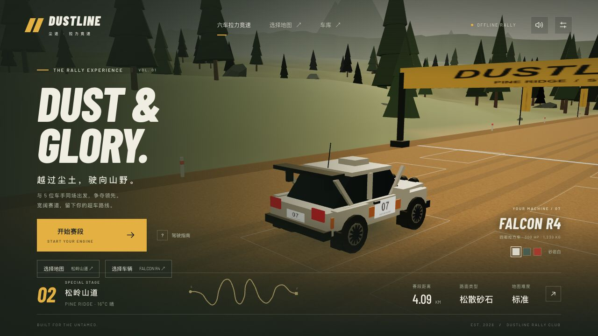
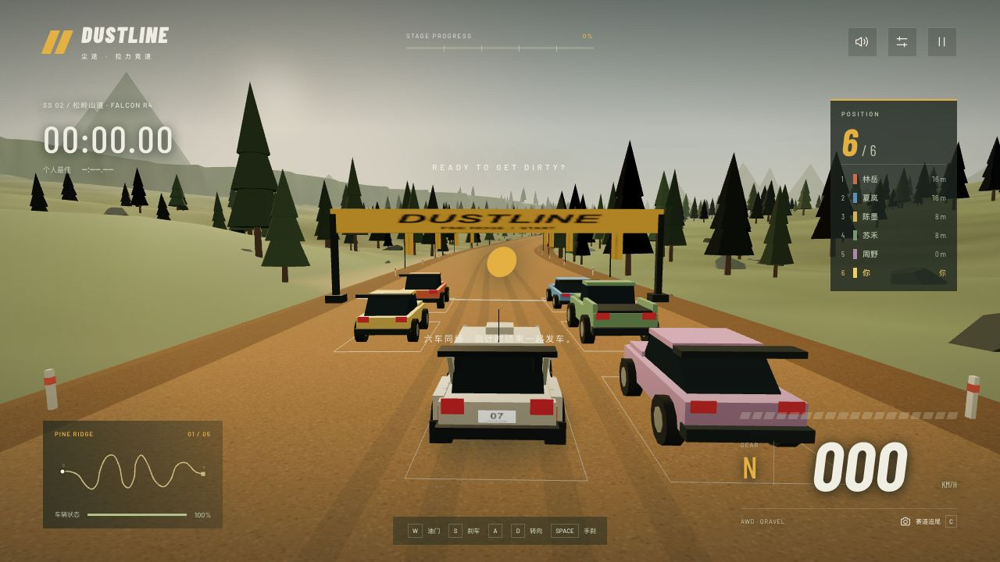
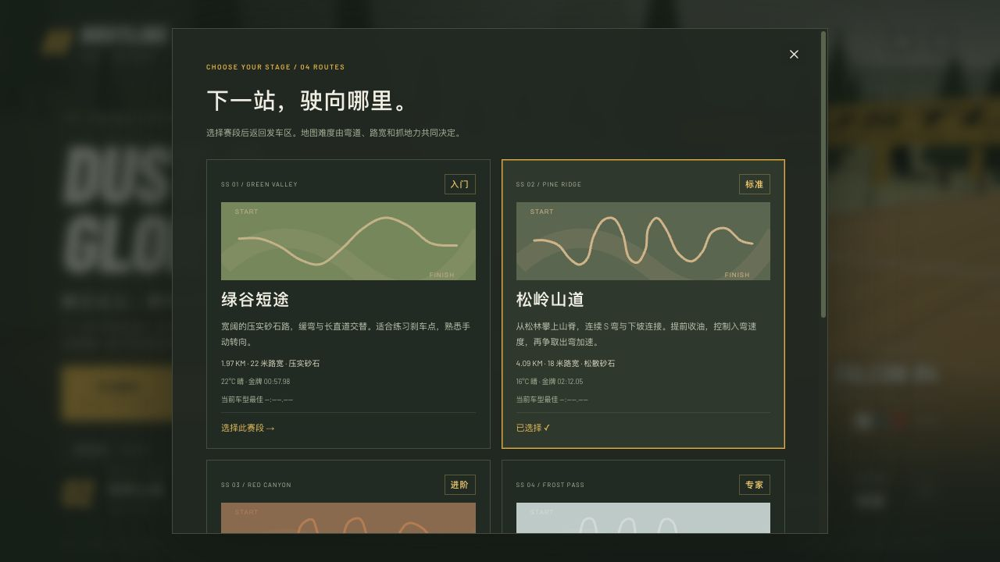
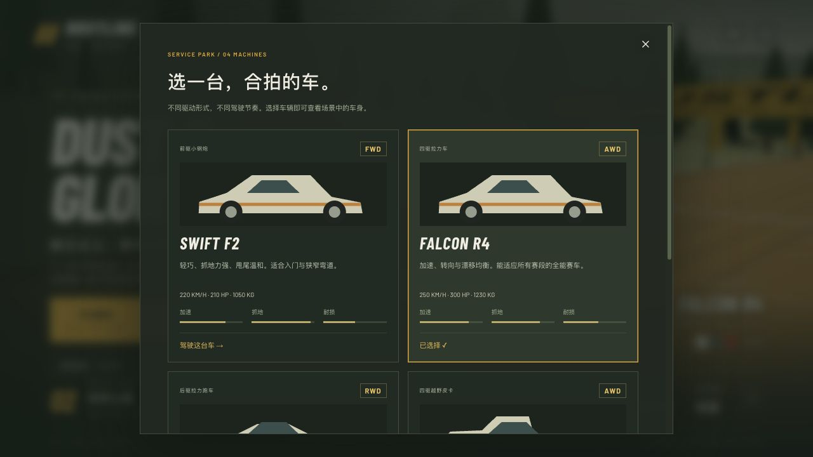

# DUSTLINE · 尘途拉力

**English** · [简体中文](README.zh-CN.md)

A 3D browser rally game set on gravel roads, forest passes, red-rock canyons, and snowy mountain routes. Pick a car, line up against five AI drivers, and race for the finish while chasing your best stage time.

Built with **Three.js, TypeScript, and Vite**. The in-game menus, HUD, and optional co-driver voice are currently in Chinese; this repository provides documentation in both English and Chinese.

## Highlights

- **Six-car races:** five AI opponents with different cars and driving speeds, corner braking, following, and overtaking behavior.
- **Four stages:** progressively harder routes, with road widths from 14 to 22 meters and different surface grip.
- **Four vehicle types:** a front-wheel-drive hatchback, an all-wheel-drive rally car, a rear-wheel-drive coupe, and an off-road pickup.
- **Manual steering:** turn the car yourself, with smooth steering input and no automatic cornering or lane centering.
- **Hold-to-drift handbrake:** longer Space holds build a larger slide; releasing the key restores grip gradually.
- **A steady camera:** road-facing chase and low camera views, interpolated movement, and no added screen shake or suspension bounce.
- **Race position and time trials:** live standings, finish order, five sector splits, medals, and local personal bests.
- **Rally atmosphere:** natural lighting, procedural scenery and cars, dust trails, fading tyre marks, engine audio, and pace notes.

## Screenshots

Actual captures from the game at 1280 × 720. The in-game interface is currently in Chinese.

**Main menu — Pine Ridge and the FALCON R4**



**Six-car starting grid and race HUD**



| Stage selection | Garage |
| --- | --- |
|  |  |

The selection screens scroll to show the remaining stages and cars. Original images and capture notes are in [docs/screenshots](docs/screenshots/README.md).

## Quick start

You will need:

- Node.js **20.19+ in the 20.x line, or 22.12+**.
- npm.
- A browser with **WebGL 2** and hardware acceleration enabled.

From the project directory:

```bash
npm ci
npm run dev
```

Open **[http://localhost:5175/](http://localhost:5175/)**.

The development port is fixed at `5175`. If it is occupied, Vite reports an error instead of choosing another port. Run the project through Vite; opening `index.html` directly from the filesystem does not start the game correctly.

For a production build:

```bash
npm run build
npm run preview
```

The build is written to `dist/`. Open the preview URL printed in the terminal. Deploy `dist/` to a static web host when ready to publish. Fonts and scene assets are bundled or generated locally; gameplay does not fetch remote models or images.

## Controls

| Action | Keyboard |
| --- | --- |
| Accelerate | `W` / `↑` |
| Brake | `S` / `↓` |
| Steer left / right | `A` / `D`, or `←` / `→` |
| Hold handbrake / drift | Hold `Space`; release to restore grip |
| Switch chase / low camera | `C` |
| Recover to the road | `R` — adds a 5-second time penalty |
| Pause / resume | `Esc` / `P` |

Touch devices have on-screen steering, throttle, brake, and handbrake buttons. Optional automatic throttle lets you focus on steering and braking; it does not steer for you.

Choose **选择地图** (Select stage) or **选择车辆** (Select vehicle) from the main menu, then press **开始赛段** (Start stage). Return to the main menu before changing the stage or car during a race.

## Stages

Distances are approximate. Each route has its own scenery, grip, and medal target.

| Stage | In-game name | Difficulty | Length | Road width | Surface |
| --- | --- | --- | --- | --- | --- |
| Green Valley | 绿谷短途 | Beginner | 1.97 km | 22 m | Firm gravel, gentle bends, high grip |
| Pine Ridge | 松岭山道 | Standard | 4.09 km | 18 m | Loose gravel, forest roads, linked S-bends |
| Red Canyon | 赤岩峡谷 | Advanced | 4.54 km | 16 m | Loose dirt, fast sections followed by sharp turns |
| Frost Pass | 雪岭关隘 | Expert | 5.42 km | 14 m | Packed snow, linked corners, reduced grip and braking |

## Garage

Top speeds assume an undamaged vehicle. Damage reduces the available top speed; all cars are capped at **250 km/h** or below.

| Car | Type / drivetrain | Top speed | Handling |
| --- | --- | --- | --- |
| SWIFT F2 | Hatchback / FWD | 220 km/h | Light, high grip, mild oversteer |
| FALCON R4 | Rally car / AWD | 250 km/h | Balanced acceleration, steering, and drift |
| COMET RS | Coupe / RWD | 250 km/h | Strong acceleration and larger slides; countersteer early |
| NOMAD T4 | Off-road pickup / AWD | 210 km/h | Durable, less off-road drag, slower steering |

Three player liveries are available: Sandstone White, Forest Green, and Racing Red. Your stage, car, livery, and other preferences are saved locally when browser storage is available.

## Racing and drifting

All six cars start after the same countdown. AI drivers adjust their speed for corners and grip, look for a free neighboring lane, and slow down behind traffic. Professional mode makes their pace faster.

The HUD shows your position and the distance to each opponent. Final position follows the actual finish order. Opponents still on the course are listed with their progress at the moment you finish. Recovery penalties affect your personal time-trial score, not the order in which cars cross the line. Pausing freezes every car; restarting returns the full field to the grid.

You must cross all **five timing gates in order**, moving forward within the road corridor. Cutting past a checkpoint does not count; recovery places you before a missed gate.

Steering changes the player's heading in world space. Releasing the steering key smoothly centers the steering input while keeping the new heading. The camera follows the road ahead independently, so the car can visibly turn and slide within the frame.

To drift, build some speed, steer into the turn, and hold `Space`. A longer hold progressively increases the slide angle. Countersteering reduces the angle; releasing `Space` lets grip return, with a longer recovery after a long hold. The handbrake continuously slows the car even with the throttle pressed. Holding it indefinitely brings the car to a stop.

Pace-note grades **2–3 indicate tighter corners**; **4–5 indicate faster corners**. Going off the road slows the car and damages it. Brake before the corner, then accelerate as you straighten out.

## Settings and saves

| Setting | Behavior |
| --- | --- |
| Standard / lightweight graphics | Lightweight mode reduces vegetation and pixel density and targets 30 fps; standard mode targets 60 fps |
| Club / professional handling | Professional mode reduces grip and increases opponent pace; applies to the next start |
| Automatic throttle | Applies to the next start; braking and handbraking still take priority |
| Sound / co-driver voice | Synthesized engine and gravel audio; Chinese pace-note speech depends on browser voice availability |
| Camera | Road-facing chase or low view |

Best times are stored separately for each **stage × vehicle × handling difficulty × throttle mode**. Previous Pine Ridge / FALCON R4 records remain readable. Settings and records use browser-local storage; there is no account or cloud synchronization.

The game pauses when its tab loses focus. Menus and paused scenes render on demand. Cars and cameras share interpolated poses; vegetation and rival wheels use instancing, and distant opponents are culled to limit rendering work.

## Development

```text
src/
├── content/          Stage and vehicle definitions
├── simulation/       Track, player handling, AI opponents, timing, standings
├── render/           Three.js scenery, cars, cameras, dust, tyre marks
├── ui/               Chinese menus, HUD, stage selection, results
├── presentation.ts   Fixed-step simulation, pose interpolation, frame pacing
├── main.ts           Application lifecycle and integration
├── input.ts          Keyboard and touch input
├── audio.ts          Engine audio and co-driver speech
├── settings.ts       Preferences and local records
└── style.css         Interface styling and responsive layouts
tests/                Node.js simulation and presentation checks
docs/screenshots/     Shared screenshot assets and capture guide
```

Useful commands:

| Command | Purpose |
| --- | --- |
| `npm run dev` | Start the development server on port 5175 |
| `npm run typecheck` | Check TypeScript without emitting files |
| `npm test` | Run the Node.js test suite |
| `npm run build` | Type-check and build to `dist/` |
| `npm run preview` | Serve the production build locally |

The tests cover manual steering, sustained handbraking, speed limits, checkpoints, ranking, AI traffic, pause/restart, saves, camera stability, interpolation, and resource disposal. They run in Node.js without opening a browser or creating a WebGL context.

**Project workflow:** do not launch the game for verification. Use the Node.js checks and production build.

## Scope and troubleshooting

This is an arcade rally game with AI opponents, not online multiplayer. AI drivers avoid traffic, but vehicle collision impulses, full tyre physics, suspension simulation, and collisions with scenery are not implemented.

If the page reports that the graphics engine is unavailable, check WebGL 2 support and hardware acceleration in your browser. On a slower device, choose lightweight graphics and keep only one game tab open. Browser speech availability varies by platform.
