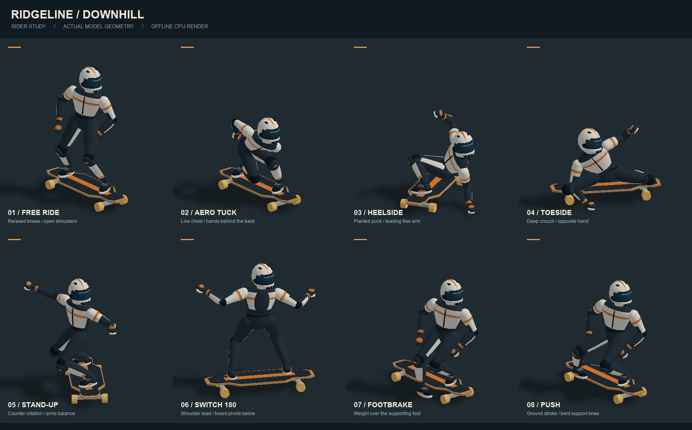

# 长板动作参考与游戏映射

本轮动作参考长板／巡航板品牌的教学资料，动作节奏、按键和减速数值为游戏设计。

- [Landyachtz — Slides & Tricks on Dinghies](https://landyachtz.com/tricks-on-dinghies-cruiser-board/)：参考预转弯、屈膝卸重、肩臂反向配合、后脚推出与收板；180° 后保持 switch 站姿。
- [Lush Longboards — Coleman / Pendulum Slide](https://lushlongboards.com/how-to/coleman-pendulum-slide/)：参考低位屈膝、前手触地支撑、另一只手臂引导滑转的姿态。

## 操作与表现

| 输入 | 游戏动作 | 动画和操控 |
| --- | --- | --- |
| 空格 + A / D | 扶地刹滑 | 预压、推出板尾、低位屈膝、一手触地、另一手展开；脚跟侧／脚尖侧依站姿和转向确定 |
| X + A / D | 站立式 speed check | 膝盖微屈、肩臂反向平衡、双手离地；板角与减速力度较轻 |
| 双击空格 / 长按空格 / Q / 180° Switch 按钮 | 180° 滑转 | 双击立即进入，或长按 0.6 秒先扶地刹滑再转入；约 0.9 秒完成卸重与旋转，Regular 左脚在前与 Switch 右脚在前互换；至少约 11 km/h 可触发 |
| S / ↓ | 脚刹 | 后脚落向路面，前脚保持踩板；Switch 时交换承担这些动作的脚 |
| W / ↑ | 蹬地 | 支撑脚留在板上，后脚接地后向后推，再抬脚收回 |
| Shift | 收身 | 降低髋部、胸口前倾、手臂收拢，视线保持朝向前进方向 |

快速双击空格：两次按下间隔不超过 320 ms，第一次按住不超过 220 ms。第二次按下立即触发滑转，释放后才能开始下一组双击。持续按住空格 0.6 秒：先进入扶地刹滑，随后自动切到 Switch 的另一侧；长按触发后必须松开才能再次触发。动作期间板头、板尾调换，原后脚变为前脚，继续沿原方向下坡。汽车、摩托车仍将空格用作制动。

松开刹滑后平滑收板；反打方向可减小滑板角度。脚刹优先于刹滑，空格扶地优先于 X 站滑。滑转期间限制转向力度并减速，不产生额外推进。Switch 改变站姿与板朝向，A / D 操控方向保持一致。

状态在固定步长模拟中推进，滑转角、手部支撑、蹬地与收身权重随位姿插值。暂停冻结动作，救援保留已完成的站姿并取消未完成动作，重开恢复 Regular。汽车与摩托车忽略 X / Q 技巧输入。

速降加速调校：正常滑行的下坡驱动力和低速蹬地力度均为初始版的 5 倍。脚刹和扶地／站立刹滑的制动力降为原来的 80%，陡坡中仍保留每秒 0.8 的最低减速以确保能够停车；速度上限不变。所有长板与 AI 共用这套加速计算。

采用现有程序几何与关节动画，没有新增图片、模型下载或后处理。验证使用 Node.js 模拟、几何与输入检查，不启动游戏、浏览器或 WebGL。

## 滑手模型与动作重绘

人物使用独立的皮衣躯干、髋部、全盔、包覆式风镜、滑板鞋与掌部刹车垫。服装拼色和细节按关节合并为顶点颜色网格，重复选择同一涂装不会逐帧上传颜色。

四肢按固定长度求解两段关节，脚和手的接触点驱动膝肘弯曲。蹲伏时后膝前收、双手放至背后；扶地时肩部随支撑手降低；站滑和 Switch 通过肩髋错转与展开双臂保持动作轮廓。脚刹将重心移向支撑脚，蹬地分为接地后推与抬脚回收。

独立模型预览只导出 Three.js 网格，再由 CPU 绘制，不加载游戏、浏览器或 WebGL：

```sh
node --import tsx scripts/preview-longboard.ts /tmp/longboard-preview.json
# Python 环境需已提供 numpy 和 Pillow；加 --rear 可检查背面。
python3 scripts/render-longboard-preview.py /tmp/longboard-preview.json docs/previews/longboard-rider.png
```


