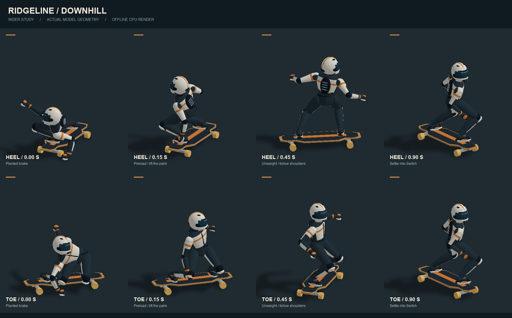
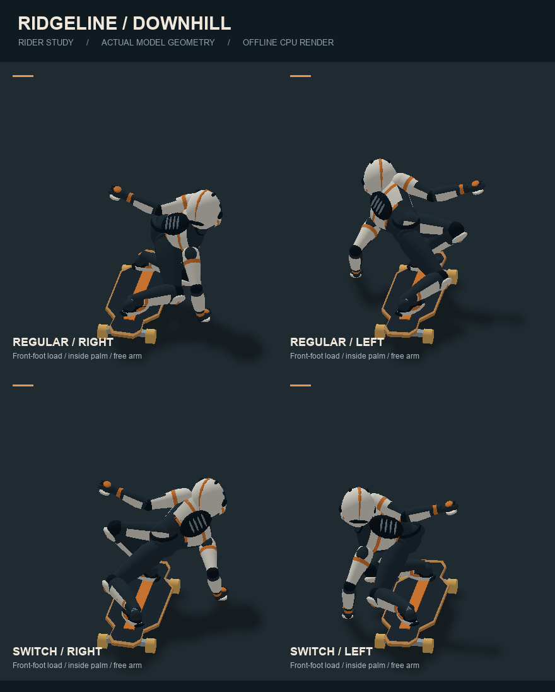
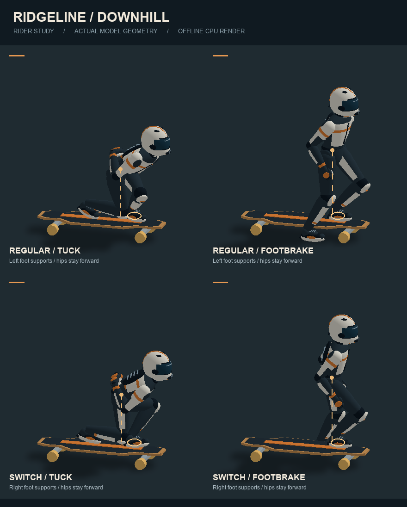
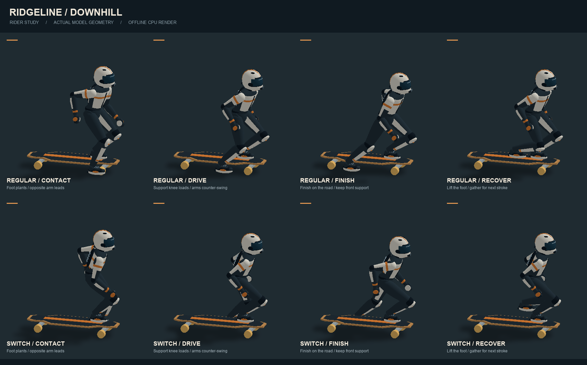
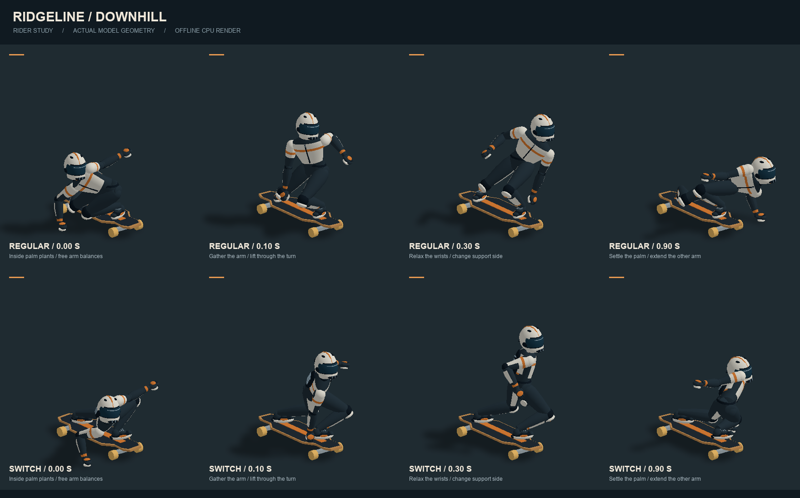

# 长板动作参考与游戏映射

本轮动作参考长板／巡航板品牌的教学资料，动作节奏、按键和减速数值为游戏设计。

- [Landyachtz — Slides & Tricks on Dinghies](https://landyachtz.com/tricks-on-dinghies-cruiser-board/)：参考预转弯、屈膝卸重、肩臂反向配合、后脚推出与收板；180° 后保持 switch 站姿。
- [Lush Longboards — Coleman / Pendulum Slide](https://lushlongboards.com/how-to/coleman-pendulum-slide/)：参考低位屈膝、前手触地支撑、另一只手臂引导滑转的姿态。
- [Motion Boardshop — Downhill Longboarding: How to Tuck](https://motionboardshop.wordpress.com/2010/07/02/downhill-longboarding-the-basics-of-how-to-tuck/)：参考前脚小角度朝前、髋部折叠、后膝靠近前腿小腿的收身姿态。

## 操作与表现

| 输入 | 游戏动作 | 动画和操控 |
| --- | --- | --- |
| A / D / 方向键 | 压弯 | 随速度和转向幅度逐渐降低重心；大幅压弯时弯内侧手套轻触路面，另一臂侧伸，视线朝向出弯方向 |
| 空格 + A / D | 扶地刹滑 | 预压、推出板尾、低位屈膝、一手触地、另一手展开；脚跟侧／脚尖侧依站姿和转向确定 |
| X + A / D | 站立式 speed check | 膝盖微屈、肩臂反向平衡、双手离地；板角与减速力度较轻 |
| 双击空格 / 长按空格 / Q / 180° Switch 按钮 | 180° 滑转 | 双击立即进入，或长按 0.6 秒先扶地刹滑再转入；约 0.9 秒完成卸重与旋转，Regular 左脚在前与 Switch 右脚在前互换；至少约 11 km/h 可触发 |
| S / ↓ | 脚刹 | 支撑脚先转向前进方向，髋部和胸口配合转正，再放下后脚；收脚回板后才恢复滑行脚位，Switch 时交换支撑脚 |
| W / ↑ | 蹬地 | 支撑脚转正并留在板上，后脚完成接地蹬程后抬起收回；支撑膝随蹬程压低，双臂反向摆动，肩髋轻微配合转动 |
| Shift | 收身 | 从髋部前折，后脚小幅收近并提跟，后膝靠近前腿小腿；肘部收拢，双手并放在腰背后，视线朝前 |

快速双击空格：两次按下间隔不超过 320 ms，第一次按住不超过 220 ms。第二次按下立即触发滑转，释放后才能开始下一组双击。持续按住空格 0.6 秒：先进入扶地刹滑，随后自动切到 Switch 的另一侧；长按触发后必须松开才能再次触发。动作期间板头、板尾调换，原后脚变为前脚，继续沿原方向下坡。汽车、摩托车仍将空格用作制动。

松开刹滑后平滑收板；反打方向可减小滑板角度。脚刹优先于刹滑，空格扶地优先于 X 站滑。滑转期间限制转向力度并减速，不产生额外推进。Switch 改变站姿与板朝向，A / D 操控方向保持一致。

状态在固定步长模拟中推进，滑转角、手部支撑、蹬地与收身权重随位姿插值。暂停冻结动作，救援保留已完成的站姿并取消未完成动作，重开恢复 Regular。汽车与摩托车忽略 X / Q 技巧输入。

速降加速调校：正常滑行的下坡驱动力和低速蹬地力度均为初始版的 5 倍。脚刹和扶地／站立刹滑的制动力降为原来的 80%，陡坡中仍保留每秒 0.8 的最低减速以确保能够停车；六款长板完好时的速度上限统一为 270 km/h。所有长板与 AI 共用这套加速计算。

采用现有程序几何与关节动画，没有新增图片、模型下载或后处理。验证使用 Node.js 模拟、几何与输入检查，不启动游戏、浏览器或 WebGL。

## 滑手模型与动作重绘

人物使用独立的皮衣躯干、髋部、全盔、包覆式风镜、滑板鞋与掌部刹车垫。服装拼色和细节按关节合并为顶点颜色网格，重复选择同一涂装不会逐帧上传颜色。

四肢按固定长度求解两段关节，脚和手的接触点驱动膝肘弯曲。蹲伏时后膝前收、双手放至背后；扶地时肩部随支撑手降低；站滑和 Switch 通过肩髋错转与展开双臂保持动作轮廓。脚刹将重心移向支撑脚，蹬地分为接地后推与抬脚回收。

进一步调整：滑行时保持柔和屈膝，扶地时抬高髋部并从胸肩侧倾触地，避免坐地劈腿和膝盖穿板；收身时肩部向前打开、肘部靠近身体，站滑手臂微屈并形成高低差。Switch 按预压、肩部引导、卸重旋转、屈膝落稳推进，头部跟随胸肩转动，双脚始终留在板面。扶地转入 Switch 时保留原支撑手，并连续计算身体相对板面的方向，避免手臂换边和肩颈跳转。

前脚承重优化：普通滑行、收身、压弯和刹滑的髋部均前移到站距的前半部，前膝承重弯曲，后膝向内收。深刹滑接近横板时仍保持前脚受力；Switch 旋转经过中立姿态后，将承重平滑交给新的前脚。脚刹与完整蹬地周期内，髋部保持在支撑脚附近，并随蹬地轻微屈伸。膝关节接近板面时沿关节旋转面抬起，不拉长腿骨或抬离支撑脚。上述调整仅改变视觉动作，不改变加速、转向、制动和碰撞规则。

动作协调优化：收身时先求解承重腿，再以实际前腿小腿位置引导后膝折叠，减少前膝过度前伸。后脚用短促抬脚动作收近约 17 cm，落稳后以脚趾为支点提跟，前脚保持踩板。脚刹和蹬地时，脚尖、髋部、胸口一起朝前，身体适度抬高；先完成支撑脚转向再让后脚离板，回板顺序相反。收身双手按躯干坐标放在腰背处，避免肘部过度外张和手套相互重叠。持续按住 Shift 时，脚刹、蹬地和 Switch 会展开上身，结束后再恢复收身；动作权重只做一次过渡，避免起身突跳。

离线回归检查覆盖两种站姿的前膝前伸范围、后膝与前腿距离、后脚趾接触及提跟、脚刹脚位顺序、腰背收手、支撑脚稳定、骨段长度与连接，以及收身进入和退出脚刹／蹬地／Switch 时的连续性与鞋底道路穿透。几何中的髋部和上半身位置用于检查视觉平衡，不等同于物理质量中心或人体生物力学仿真。

压弯与蹬地协调：深压弯和扶地刹滑中，脚位随屈膝逐渐打开，前膝横向随脚尖弯曲，后膝向前腿小腿收拢；髋部侧移略微收小，使双膝保持紧凑。护膝与腿部衣料的朝向采用求解后的关节弯曲平面，避免换向时翻转。蹬地采用接地、驱动、完成、回收四段表现：地面蹬程从 66 cm 收至 56 cm，髋部压低保持到蹬程末端，防止后脚因超出腿长提前悬空；回收抬脚在起落处平滑过渡。双臂与工作腿反向摆动，胸肩和髋部做小幅错转，支撑脚始终保持踩板。蹬地动作的进入和退出稍微放缓，让摆臂顺畅衔接收身；推进、转向和制动数值不变。

新增回归覆盖完整接地蹬程、左右臂反向摆动、回收脚离地、两种站姿下的压弯膝距和脚尖朝向，以及从右深压弯连续转入左深压弯时的关节位置与护膝旋转。动画仍只由固定步长状态和蹬地相位驱动，渲染不会额外推进动作时间。

手臂与手腕优化：以肩部为基准连续引导肘部弯曲，避免手掌经过原肘部目标时发生反向折叠。收身时双肘沿身侧绕到腰背，普通收身节奏稍微放缓；脚刹进入和退出时仍保持身体与脚位同步。袖子和护肘跟随实际关节弯曲平面转动，消除接近 180° 的突然翻转。普通滑行、蹬地和脚刹中的放松手掌朝向身体，平衡手抬起后逐渐转向路面；扶地时掌垫保持原有接触方向。手腕与袖口保持连接，双手收在腰背时仍避免重叠。

新增检查逐帧覆盖 Regular／Switch 下的换向、蹬地、收身和 180° 滑转，同时检查肘部位置、袖子旋转及手腕旋转；放松手掌朝内、扶地接触、固定骨长、前脚承重和脚刹回脚顺序均保留回归检查。未增加模型网格、贴图或渲染层。

人物补齐从皮衣领口到头盔的动态颈部连接，增加护肩、髋部护垫、背部护具纹理、膝盖拼色、手套指节和鞋头鞋跟细节。细节仍合并进关节网格；当前每位滑手连同长板共 31 个网格、约 1.32 万三角形，没有新增贴图或后处理。

转弯姿态按用户提供的两张速降截图调整：胸口前压、髋部向前脚靠拢、双膝屈曲收拢，内侧手低位支撑，另一臂在肩高附近横向展开。普通转弯从低速的小幅重心变化逐渐进入高速深压弯，左右换向先抬起支撑手、经过中立姿势，再压向另一侧；转向姿态本身不触发制动或 Switch。扶地刹滑也使用新的低姿态和侧伸手臂。Regular 与 Switch 分别映射内侧支撑手及板面倾斜，手套接触高度会补偿板面的侧倾。

独立模型预览只导出 Three.js 网格，再由 CPU 绘制，不加载游戏、浏览器或 WebGL：

```sh
node --import tsx scripts/preview-longboard.ts /tmp/longboard-preview.json
# Python 环境需已提供 numpy 和 Pillow；加 --rear 可检查背面。
python3 scripts/render-longboard-preview.py /tmp/longboard-preview.json docs/previews/longboard-rider.png
# 正反两侧扶地转入 Switch 的连续关键帧。
node --import tsx scripts/preview-longboard.ts /tmp/longboard-switch-preview.json --switch
python3 scripts/render-longboard-preview.py /tmp/longboard-switch-preview.json docs/previews/longboard-switch.png
# 两种站姿的左右压弯，使用接近参考截图的后方视角。
node --import tsx scripts/preview-longboard.ts /tmp/longboard-turns.json --turns
python3 scripts/render-longboard-preview.py /tmp/longboard-turns.json docs/previews/longboard-turns.png --turns
# 前脚支撑侧视图：圆圈标记支撑脚，虚线为髋部垂直投影。
node --import tsx scripts/preview-longboard.ts /tmp/longboard-balance.json --balance
python3 scripts/render-longboard-preview.py /tmp/longboard-balance.json docs/previews/longboard-front-foot.png --balance
# 两种站姿的完整蹬地周期：接地、驱动、完成和回收。
node --import tsx scripts/preview-longboard.ts /tmp/longboard-push.json --push
python3 scripts/render-longboard-preview.py /tmp/longboard-push.json docs/previews/longboard-push.png --push
# 连续换向的手臂与手腕关键帧，两种站姿各四帧。
node --import tsx scripts/preview-longboard.ts /tmp/longboard-turn-transition.json --turn-transition
python3 scripts/render-longboard-preview.py /tmp/longboard-turn-transition.json docs/previews/longboard-turn-transition.png --turn-transition
```











